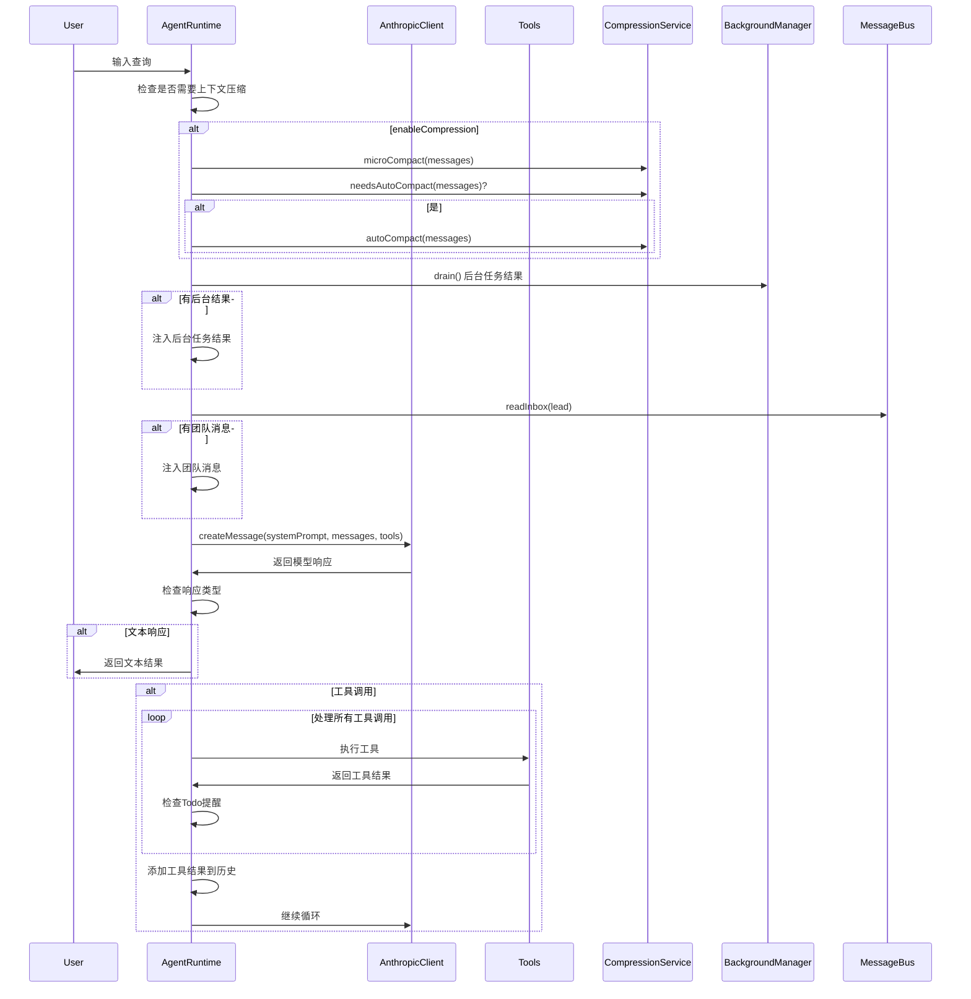
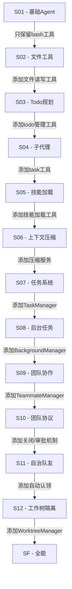
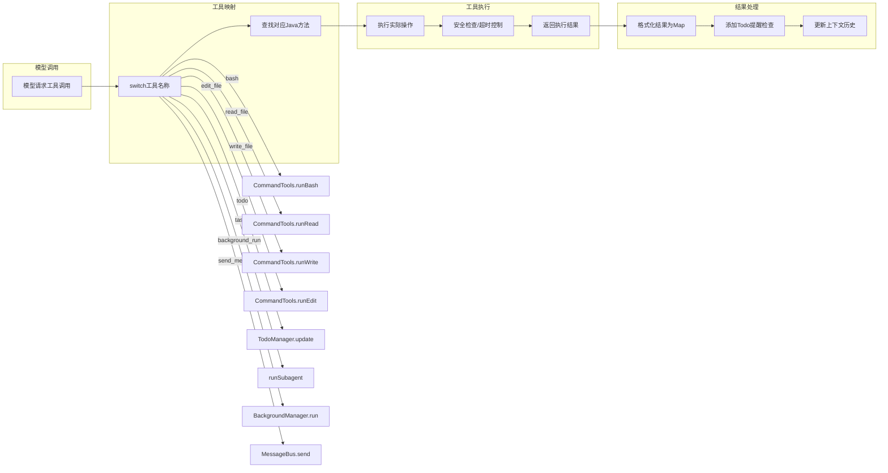
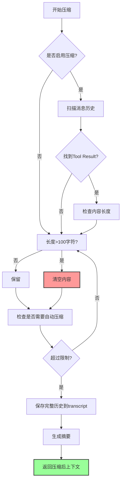
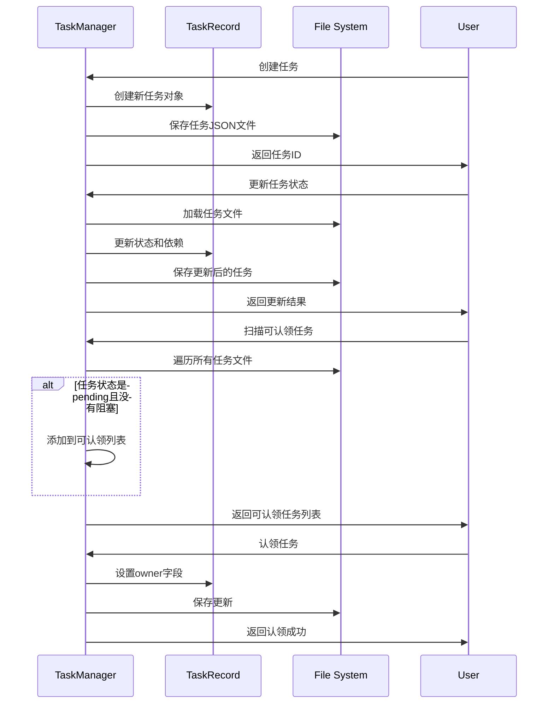
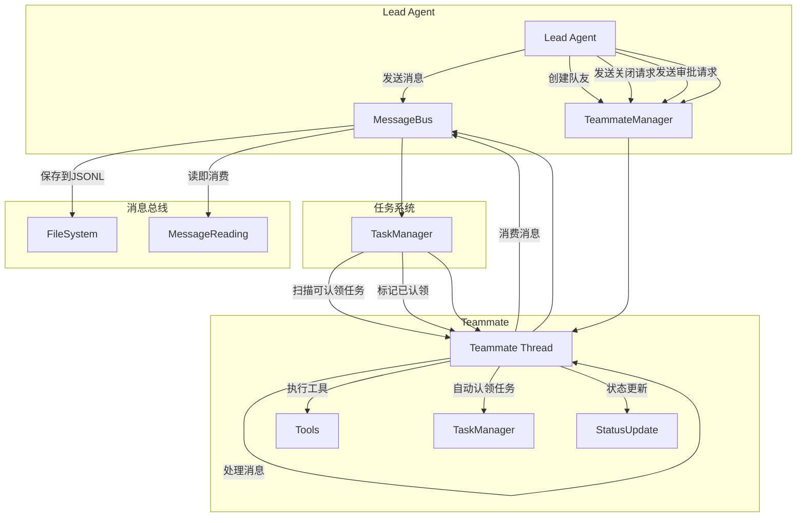
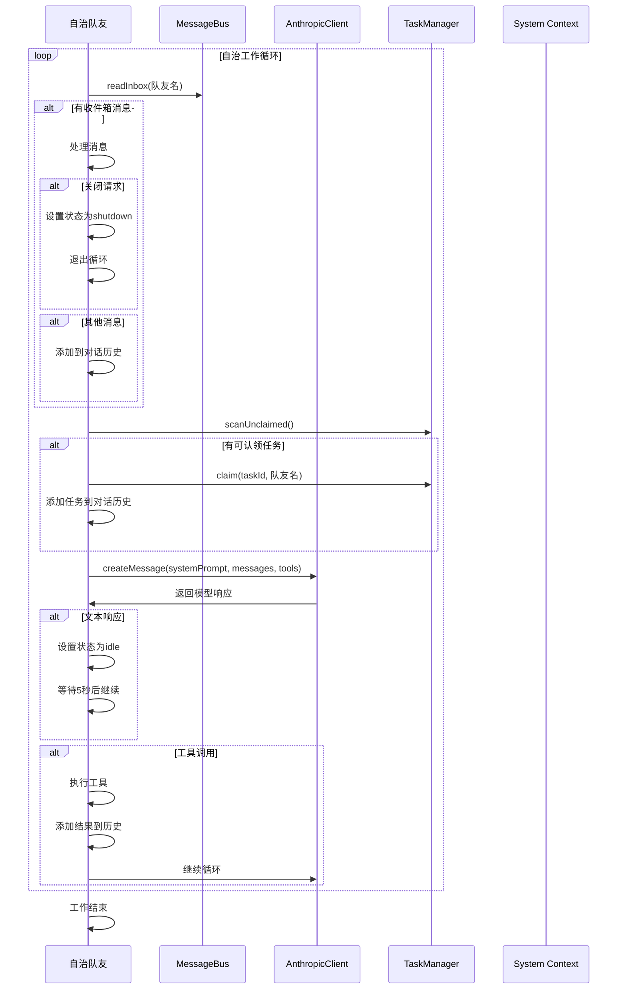
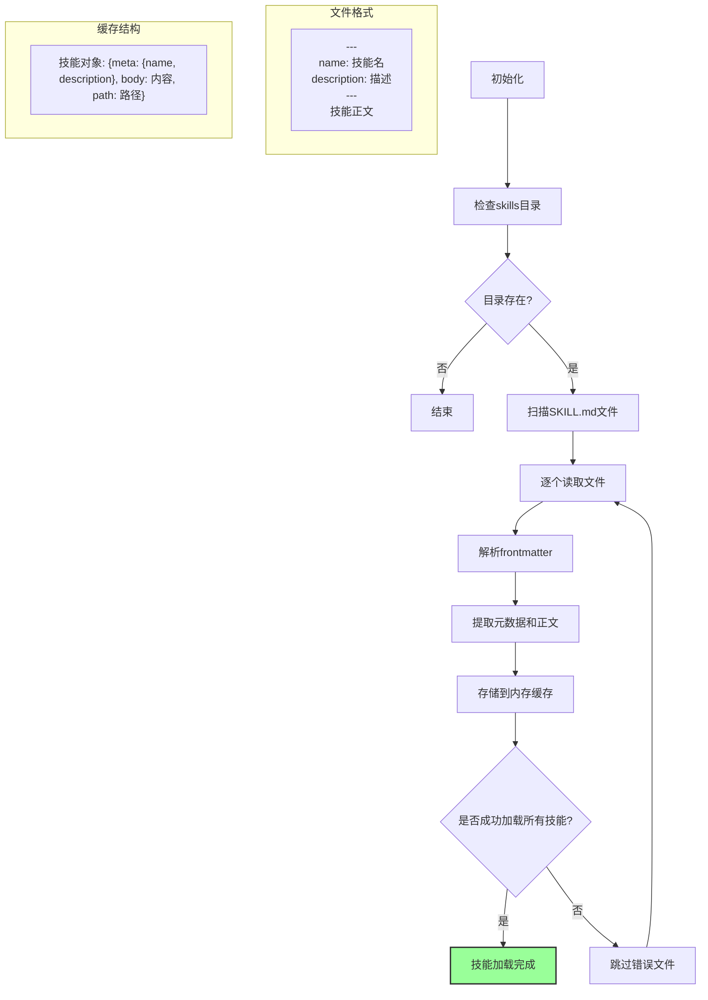
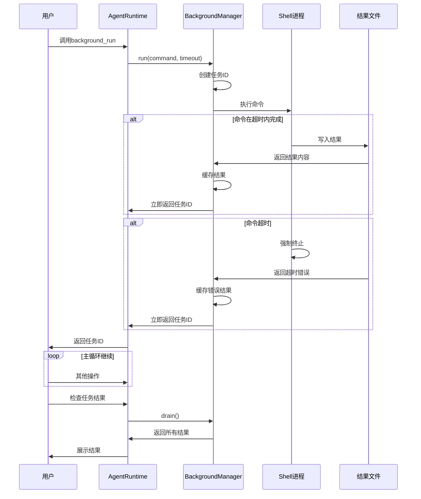

# Java Agent 项目架构与流程详解

## 项目概述

这是一个基于 Claude Code 概念的教育性 Agent 项目，通过 S01-S12 和 SFull 共 13 个阶段，逐步展示从简单到复杂的 Agent 能力演进。项目采用分层架构设计，核心思想是通过配置而非代码变更来扩展 Agent 能力。

## 核心架构设计

### 1. 整体架构图

```mermaid
graph TB
    subgraph "Agent 层"
        A01[S01AgentLoop] --> A02[S02ToolUse]
        A02 --> A03[S03TodoWrite]
        A03 --> A04[S04Subagent]
        A04 --> A05[S05SkillLoading]
        A05 --> A06[S06ContextCompact]
        A06 --> A07[S07TaskSystem]
        A07 --> A08[S08BackgroundTasks]
        A08 --> A09[S09AgentTeams]
        A09 --> A10[S10TeamProtocols]
        A10 --> A11[S11AutonomousAgents]
        A11 --> A12[S12WorktreeTaskIsolation]
        A12 --> AF[FullAgent]
    end

    subgraph "运行时层"
        RT[AgentRuntime] --> LC[Launcher]
        RT --> AC[AppContext]
    end

    subgraph "配置层"
        SC[StageConfig] --> RT
        SC --> S01[stage.s01]
        SC --> S02[stage.s02]
        SC --> S03[stage.s03]
        SC --> S04[stage.s04]
        SC --> S05[stage.s05]
        SC --> S06[stage.s06]
        SC --> S07[stage.s07]
        SC --> S08[stage.s08]
        SC --> S09[stage.s09]
        SC --> S10[stage.s10]
        SC --> S11[stage.s11]
        SC --> S12[stage.s12]
        SC --> SF[stage.sFull]
    end

    subgraph "工具层"
        CT[CommandTools] --> RT
        TD[TodoManager] --> RT
        TS[TaskManager] --> RT
        BG[BackgroundManager] --> RT
        MB[MessageBus] --> RT
        TM[TeammateManager] --> RT
        WT[WorktreeManager] --> RT
        CS[CompressionService] --> RT
        SL[SkillLoader] --> RT
    end

    subgraph "模型层"
        ANT[AnthropicClient] --> RT
    end

    subgraph "数据层"
        CM[ChatMessage] --> RT
        TR[TaskRecord] --> TS
        TI[TodoItem] --> TD
    end

    LC --> RT
    AC --> RT
    RT --> ANT
```



### 2. AgentRuntime 主循环流程



### 3. StageConfig 渐进式配置演进



### 4. 工具执行流程



### 5. 上下文压缩流程



### 6. 任务管理流程



### 7. 团队协作流程



### 8. 自治队友工作循环



### 9. 技能加载流程



### 10. 背景任务流程



## 核心设计理念

### 1. 渐进式能力演进
- **特点**：每个阶段只增加特定能力，避免一次性引入所有复杂性
- **实现**：通过 StageConfig 的配置开关控制可用工具
- **优势**：学习曲线平缓，从简单命令执行到复杂团队协作

### 2. 工具驱动架构
- **模式**：Agent 能力通过工具暴露，而不是硬编码逻辑
- **映射**：模型调用的工具映射到本地 Java 实现
- **优势**：支持工具组合和扩展，易于维护

### 3. 上下文管理策略
- **三层压缩**：
  1. **微压缩**：清理较老的工具结果
  2. **自动压缩**：长对话时生成摘要并保存完整历史
  3. **转录**：所有历史保存到 transcript 目录
- **优势**：解决长对话的上下文窗口限制

### 4. 协作模式演进
- **阶段**：单 Agent → 多 Agent 协作 → 自治团队
- **通信**：文件型消息总线，实现低依赖的 Agent 间通信
- **状态**：任务板作为共享工作空间
- **协议**：支持关闭请求和计划审批等高级协作机制

### 5. 状态持久化策略
- **文件存储**：任务、队友状态、消息都通过文件持久化
- **原子性**：操作后立即保存，保证数据一致性
- **隔离性**：工作树隔离不同任务，避免上下文污染

## 使用示例

### 示例1：基础文件操作（S02）

```bash
# 运行S02阶段
mvn exec:java -Dexec.mainClass=com.learnclaudecode.agents.S02ToolUse

# 在Agent中
User: 创建一个HelloWorld.java文件
Agent: <tool_code>
write_file(path: "HelloWorld.java", content: "public class HelloWorld { public static void main(String[] args) { System.out.println(\"Hello, World!\"); } }")
</tool_code>
User: 编译并运行
Agent: <tool_code>
runBash(command: "javac HelloWorld.java && java HelloWorld")
</tool_code>
```

### 示例2：Todo规划（S03）

```bash
# 运行S03阶段
mvn exec:java -Dexec.mainClass=com.learnclaudecode.agents.S03TodoWrite

# 在Agent中
User: 帮我重构这个项目的代码结构
Agent: <tool_code>
todo(items: [
    {id: 1, text: "分析现有代码结构", status: "active"},
    {id: 2, text: "设计新的模块划分", status: "pending"},
    {id: 3, text: "重构核心类", status: "pending"},
    {id: 4, text: "更新测试用例", status: "pending"}
])
</tool_code>
```

### 示例3：团队协作（S11）

```bash
# 运行S11阶段
mvn exec:java -Dexec.mainClass=com.learnclaudecode.agents.S11AutonomousAgents

# Lead Agent创建自治队友
User: 创建一个Python专家队友帮我处理相关任务
Agent: <tool_code>
spawn(name: "python-expert", role: "Python开发专家", prompt: "帮助处理Python相关的代码分析和重构任务", autonomous: true)
</tool_code>

# Python专家自动认领任务
Agent: <auto-claimed>Task #5: 分析Python代码库
发现了多个潜在的性能优化点...</auto-claimed>
```

## 扩展指南

### 1. 添加新工具
1. 在 CommandTools 或其他工具类中实现方法
2. 在 AgentRuntime.executeTools() 中添加映射
3. 在相应的 StageConfig 中添加工具配置

### 2. 扩展新能力
1. 创建新的能力管理类（如 CustomManager）
2. 在 AppContext 中初始化
3. 在 StageConfig 中添加开关
4. 在 AgentRuntime 中集成

### 3. 自定义提示词
修改 StageConfig 中的 systemTemplate 字段，使用 ${WORKDIR} 等变量。

## 总结

这个 Java Agent 项目展现了 Claude Code 风格 Agent 的完整实现：

1. **分层架构**：清晰的 Agent、运行时、配置、工具、模型、数据分层
2. **渐进式学习**：13个阶段逐步引入复杂概念
3. **工具化执行**：模型决策 + 本地执行的闭环模式
4. **状态管理**：文件持久化确保数据一致性
5. **协作机制**：多 Agent 通过简单协议协作
6. **扩展性**：通过配置和工具支持能力扩展

整个架构体现了现代 AI Agent 的核心设计理念：**配置驱动、工具化执行、状态持久化、协作扩展**。